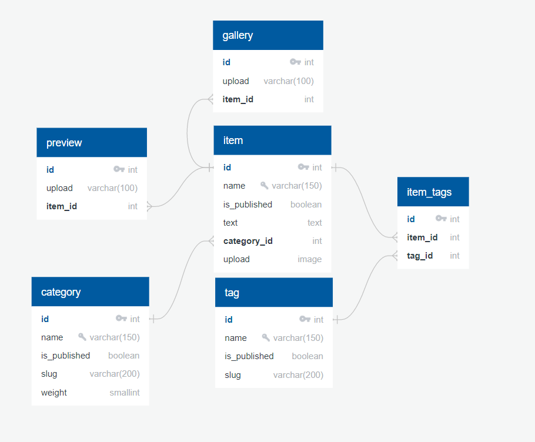

# Homework
## Repository for doing Yandex homework
___
## Instalation

- ### Install virtualenv
```
pip install virtualenv
```
- ### Create venv
#### Windows
```
python -m venv venv
```
#### Linux
```
python3 -m venv venv
```
- ### Activate venv
#### Windows
(For Windows you need to allow PowerShell scripts to run)
```
Set-ExecutionPolicy Unrestricted -Scope Process
```
```
venv\Scripts\activate.ps1
```
#### Linux
```
source venv/bin/activate
```
- ### Install requirements.txt
```
pip install -r requirements.txt
```
- ### Migrate the migrations
#### Windows
```
python manage.py migrate
```
#### Linux
```
python3 manage.py migrate
```
- ### Load test data from fixtures
#### Windows
```
python manage.py loaddata catalog/fixtures/data.json
```
#### Linux
```
python3 manage.py loaddata catalog/fixtures/data.json
```
- ### Run the project
#### Windows
```
python manage.py runserver
```
#### Linux
```
python3 manage.py runserver
```
Then go to http://127.0.0.1:8000

To store DEBUG and SECRET_KEY parameters are used environment variables.
You can create and set values, or change the value in settings.py
___
## Added test database
### Structure of db

- Admin login: test_admin
- Admin email: test@test.com
- Admin password: password